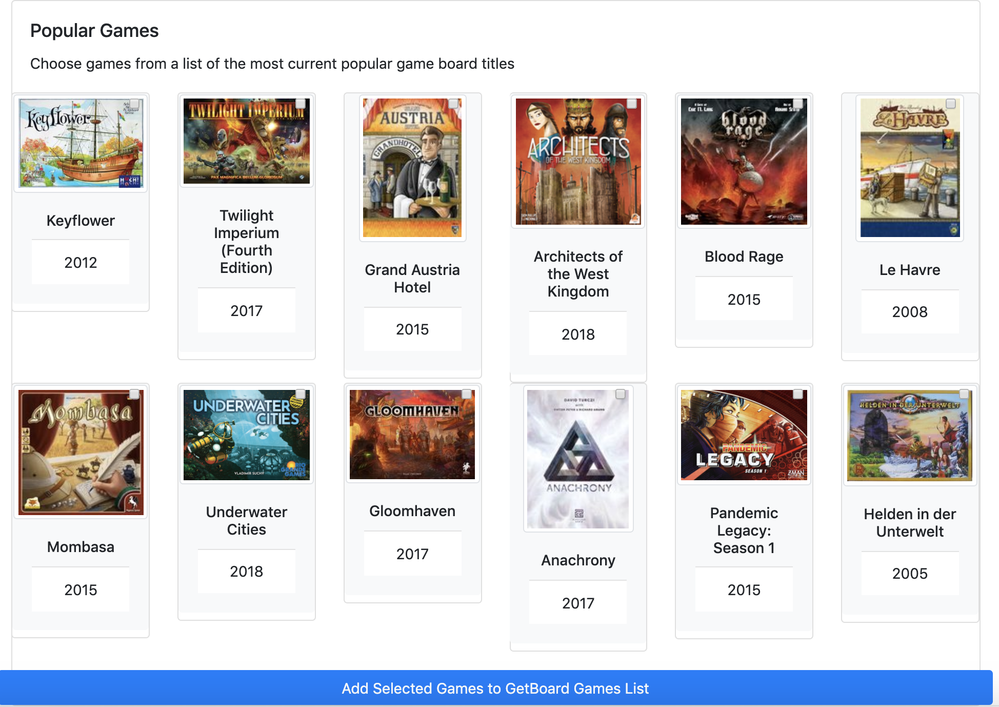

# getboard
Get Board: Table-top boardgames recommendation engine 

## DESCRIPTION
GetBoard is a recommendation engine for table-top board-games. To build the recommendation engine we need to utilized existing user-game interaction data. [Boardgamegeek](https://boardgamegeek.com/) is a popular website that houses rich data and is made available via it's API (https://boardgamegeek.com/wiki/page/BGG_XML_API2). 

For us, the first step was to build a list of users. The website allows public users to search for users based on zipcode. Only those users shows up in the list who have opted-in to be searched. There are more than 33k zipcodes in the US. We picked the top 10k based on population and then scrapped all users within 25 miles of each zipcode. This yielded us about 36k users. 

The API allows querying different types of data associated with each users. It includes their board-games collection, game-play information, ratings and comments for board-games. Extracting this data took about 4 days as we limited ourselves to about 1 call per 2 seconds.  

- **userinfo.zip**
  - Comma separated file containing user level data
  - Zipped size = 75 MB, Unzipped = 449 MB
  - Number of records: 7,713,598
  - Number of records with ratings: 4,745,923
  - Number of users: 31,541
  - On average, each user has rated ~150 board-games
  - Fields: username, gameid, userrating, own, prevowned, fortrade, want, wanttoplay, wanttobuy, wishlist, wishlistpriority, preordered, numplays, lastmodified
- **usercomments.zip**
  - File containing user comments
  - Zipped size = 83 MB, Unzipped = 246 MB
  - Number of records: 1,153,529 
  - Fields: username, gameid, userrating, comment
- **gamesinfo.zip**
  - File containing information about games
  - Zipped size = 3MB, Unzipped = 11MB
  - Number of records: 62,605
  - Fields: gameid, userrating, primaryname, yearpublished, gamerank, usersrated, bayesaverage minplayers, maxplayers, playingtime, minplaytime, maxplaytime, thumbnail

## INSTALLATION STEPS

1. Clone the repository (https://github.gatech.edu/akumar627/getboard.git)
2. Download data from [Google Drive](https://drive.google.com/open?id=1dgZmv85mhZbLFt7208oHWlqT2Ex2yCv_), unzip and put it in the `data` folder of the cloned repository
3. Install Postgres.app, If you are on Mac download it from [postgres.app](https://postgresapp.com/). If you are on Windows or another OS, use [PostgreSQL database download](https://www.enterprisedb.com/downloads/postgres-postgresql-downloads)
4. Open Postgres.app and start PostgreSQL server
5. Change directory to getboard directory and run the following command to set up the database: `psql -f postgres_setup.sql`
6. Create a new conda environment with `conda create -n getboard python=3.7`
7. Run `conda activate getboard`
8. Install requirments using `pip install -r requirements.txt`
9. Edit `app.py` on line 14 by replacing the quoted `"db"` and `"dbuser"` in `db, dbuser, dbhost = "db", "dbuser", "localhost"` to correspond to your db and dbuser
10. Run the app using `python app.py`
11. Open your web browser and navigate to the listed url. (eg. http://127.0.0.1:5001/). Incase port 5001 is already assigned you can change the last line in `app.py` to another port

## EXECUTION

#### New user workflow

From the the GetBoard homepage you are asked to select games (by clicking on images) you like.
There are two sections to choose from: game search and popular games list.
In game search you may search your game by title.

You then select from the results of your search and click on "Add selected games to GetBoard games list" 

Similarly you may click on games in the popular section and save to your games list.

From your games list, choose which games you want to feed into the GetBoard recommendation engine
then click the GetBoard button.

Below you will see your top 12 recommended board games based on your selection.

#### Existing users of Boardgamegeek.com

*If you are not a boardgamegeek (bgg) user you can test this functionality out with username: xatsmann

Log in by entering your username at the top right hand corner of the homepage.

Here you will find your list of games you have saved in your bgg profile, 
along with a bottom section of recommended games (top 6).  You can filter by category, mechanic, max playing time, 
and minimum amount of players then clicking on Apply Fiters. 

 